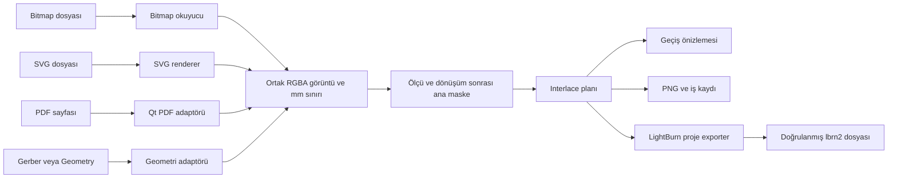

# Görsel interlace uygulama mimarisi

Tarih: 2026-10-02. Girdi: [spec.md](spec.md). Bu dosyadaki yollar Evo hedefindeki planlanan kod yollarıdır; mevcut dosya oldukları iddia edilmez.

## Mimari karar

Kaynak okunur, gerçek ölçüye örneklenir, tek bir ana maske hazırlanır. Interlace yalnız bu maskenin satır üyeliğini hesaplar. Exporter kaynak dosyayı tekrar render etmez. UI, önizleme ve exporter aynı immutable iş snapshot'ını kullanır.



Bu şema veri akışıdır. Python import yönü ayrıca aşağıdaki tabloda kısıtlanmıştır.

## Paket sınırları

| Paket | Sorumluluk | İzin verilen proje içi bağımlılık |
|---|---|---|
| `mikrocam.core` | Veri modelleri, birimler, grid, ortak placement | Kendi modülleri |
| `mikrocam.importers` | Bitmap/SVG okuma; kaynak biçimi inceleme | `core` ve kendi modülleri |
| `mikrocam.laser` | Normalizasyon, interlace, recipe, PNG ve LightBurn export | `core` ve kendi modülleri |
| `mikrocam.bridge` | UI iş akışını birleştirme; Qt PDF ve legacy uyarlama | `core`, alan paketleri, kendi modülleri |
| `mikrocam.ui` | Qt formları, sinyaller, görüntüleme | `bridge`, `core` |
| Evo host | Paneli menüye bağlama | `mikrocam.ui` için kısa bağlantı |

`importers` ile `laser` birbirini import etmez. PDF için Qt kullanımı `bridge` içinde kalır; çekirdeğe QImage/QObject sızmaz. PNG codec'in iki somut tüketicisi recipe ve LightBurn exporter olduğu için `laser/png_codec.py` içinde ortaklaştırılır. Renderer registry, abstract importer, plugin sistemi veya bağımlılık enjeksiyonu altyapısı kurulmaz; bridge'deki açık format dispatch'i yeterlidir.

## Planlanan dosyalar

```text
mikrocam/
  core/
    visual.py                 # SourceAsset, SourceInfo, RasterFrame, RasterGrid, BurnMask
    interlace_job.py           # InterlaceSettings, InterlacePass, InterlacePlan
    placement.py               # roadmap placement-transform ile aynı tip, ikinci transform yok
  importers/
    bitmap.py                 # Pillow; EXIF yönü, kare/sayfa seçimi, RGBA
    svg.py                    # resvg_py; statik SVG görünümü
    source_validation.py      # format, boyut, SVG dış kaynak/font kontrolü
  laser/
    normalize.py              # örnekleme sonrası alpha, gri ton, eşik, ters renk
    interlace.py              # gruplar, sıra, tur, lazy geçiş maskesi
    preview.py                # düşük çözünürlüklü renkli görünüm; üretim verisini değiştirmez
    png_codec.py              # bool maske <-> kayıpsız siyah/beyaz PNG
    recipe_io.py              # sürümlü JSON iş kaydı ve migration
    lightburn_profile.py      # tek sürüm/device için doğrulanmış alan ve yetenek verileri
    lightburn_export.py       # profil kontrollü native proje yazımı
  bridge/
    visual_workflow.py        # kaynak -> maske -> plan -> kayıt/export orkestrasyonu
    pdf_source.py             # QPdfDocument -> bağımsız NumPy RGBA
    gerber_source.py          # isteğe bağlı legacy geometri -> ortak görsel kaynak
    visual_project.py         # var olan proje kaydına minimal payload bağlantısı
  ui/
    visual_interlace_panel.py # mevcut host içinde bir panel
    visual_preview.py         # görüntü, tek geçiş, birleşim, sıra listesi
tests/
  unit/                       # core/laser için Qt ve donanım yok
  integration/                # importer, Qt PDF, recipe ve proje yeniden açma
  reference/visual/           # sentetik ve lisansı uygun sabit örnekler
  reference/lightburn/        # gerçek uygulamadan küçük altın örnekler ve manifest
```

`core/placement.py` veya iş modeli hedef repoda zaten varsa tekrar oluşturulmaz; mevcut tipe bu sözleşme uygulanır. `LaserJob` ile `CNCJob` birleştirilmez. `InterlacePlan`, mevcut `LaserJob` içinde raster işlem payload'ı olarak tutulabilir; ikinci global iş sistemi kurulmaz.

## İşlem basamakları

1. **İncele:** Dosya imzası, boyut, piksel/sayfa sayısı ve ölçü kaynağını oku. Tüm dosyayı dev belleğe açmadan limitleri kontrol et.
2. **Seç:** Çok kareli kaynakta kare/sayfa, mm boyutu, DPI, opsiyonel kırpma, ayna ve dönüşü kesinleştir.
3. **Grid kur:** [Veri modelindeki](data-model.md) tam sayı boyut ve padding kuralını kullan. Resmi N'e bölerken çözünürlüğü düşürme.
4. **Bir kez render et:** Bitmap, SVG, PDF aynı hedef grid'e gelir. Geometrik dönüşüm bu aşamada uygulanır. Exporter'da bir daha uygulanmaz.
5. **Bir kez normalize et:** Beyaz zemin, gri dönüşüm, eşik ve varsa ters renk; `BurnMask` üretilir.
6. **Planla:** N grubu ve tur sıraları hesaplanır; etkin/boş geçiş bilgisi belirlenir.
7. **Önizle:** Kaynak görünümü, ana maske, tek grup ve birleşim aynı snapshot'tan türetilir.
8. **Kaydet:** Kaynak byte snapshot'ı, tam ana maske ve bütün ayarlar sürümlü JSON'a gömülür.
9. **Dışa aktar:** Profil uyumluluğu kontrol edilir; geçişler sırayla PNG'ye kodlanıp proje içine gömülür; geçici dosya doğrulanıp atomik değiştirilir.

UI değişikliği mevcut snapshot'ı yerinde değiştirmez. Her yeniden üretimde `revision` artar; eski worker sonucu yeni revizyonun üzerine yazılmaz. Export yalnız son başarıyla üretilmiş ve ekranda gösterilen revizyonu kullanır.

## Bağımlılık kararı

| Bileşen | Seçim | Gerekçe / koşul |
|---|---|---|
| Bitmap ve PNG codec | Pillow `12.3.0` | Ortamda mevcut; hedefte doğrudan sabitlenmeli, dolaylı bağımlılığa güvenilmemeli |
| Sayısal veri | Mevcut NumPy | bool/uint8 diziler ve deterministik işlemler |
| SVG | `resvg_py==0.5.0` | Statik görünüm/clipping gereksinimi; Windows ABI3 wheel var, hedefte kurulum ve golden test kapısı |
| PDF | Mevcut PyQt6 `QtPdf` | Yerel 6.11.0 ortamında sayfa render denemesi geçti; bridge içinde lazy import |
| XML/JSON | stdlib, gerektiğinde mevcut lxml | `.lbrn2` alanları gerçek fixture ile belirlenir |

Yeni bağımlılıklar bu belge turunda kurulmadı. Hedefte `requirements-visual.txt` ile Pillow/resvg sürümleri sabitlenir; release paketi bu gereksinimleri içerir. Qt PDF paketleme testinde modülün ve lisans metinlerinin dağıtıma girdiği doğrulanır. Bağımlılık yoksa yalnız ilgili içe aktarma kapalı olur.

QtSvg yerel basit çizim denemesini geçti; ancak genel SVG görünümü için clipping sınırlamaları nedeniyle varsayılan renderer seçilmedi. Legacy ParseSVG geometri çıkarıcısı da bütün SVG görünümünün yerine geçmez. CairoSVG ve pypdfium2 alternatifleri [araştırmada](research.md) değerlendirilmiştir. resvg kurulumu başarısız olursa sessizce QtSvg'ye geçilmez; renderer kararı kanıtla güncellenir.

## Thread ve bellek yönetimi

- Dosya decode/render/encode işlemleri UI thread'ini bloke etmez. PDF QObject'leri kendilerini oluşturan tek worker thread'inde yaşar; QImage verisi NumPy'ya kopyalanıp Qt nesnesinden ayrılır.
- `core` ve `laser` global değiştirilebilir durum kullanmaz; iptal kontrolü normal fonksiyon/callback ile aktarılır.
- UI nesnelerine worker'dan erişim yoktur. Bitmiş sonuç ve ilerleme sinyalle gönderilir.
- Tam çözünürlükte N maskeyi aynı anda saklama. Ana maske + en fazla bir geçiş buffer'ı; export sıralı yazılır. Tur tekrarında aynı grup PNG'si tekrar render edilmez.
- İlk kaynak limiti 64 MiB, nihai grid limiti 40 milyon piksel; tahmini çalışma belleği 1 GiB üzerinde ise işlem başlamaz. Bunlar ürün limitidir; makine performansı vaadi değildir.
- SVG/PDF renderer kendi içinde ek bellek kullanabilir. Boyut limiti, hata yakalama ve iptal kontrolü zorunludur; uzun native render iptal gecikmesi ayrıca ölçülür.
- Gömülü base64 verileri yazarken büyük ek kopyalar yapılmamalı; dosya akışına yazım tercih edilir. Limitler çözülmüş görüntü ve gömülü kaynak toplamını da kapsar.

## Kalıcı kayıt

Ana taşınabilir kayıt, roadmap'teki sürümlü JSON recipe yaklaşımının `visual_interlace` payload'ıdır. Yeni `.mcam` uzantısı icat edilmez. Ana maske ve kaynak bytes gömülüdür; yalnız dosya yoluna güvenilmez. Kaydet/aç aynı maskeyi kullanır; renderer sürümünü değiştirip otomatik yeniden çizmez.

Evo proje kaydı bağlantısı G01'de gerçek hedef API üzerinden belirlenir. Mevcut proje metadata alanı varsa payload oraya eklenir; Geometry taşıyıcı gerekiyorsa yalnız projedeki içeriği temsil eder. Yeni FlatCAM nesne türü oluşturma varsayımı yoktur. Proje serializer'ı uygun değilse JSON iş kaydı yine çalışır; host proje entegrasyonu ayrı görev olarak eksik kalır, sessiz yan dosya bağımlılığı eklenmez.

## LightBurn doğrulama kapısı

G02 olmadan native dosya şeması kodlanmaz. Hedef sürüm/device ailesi, gömülü bitmap, Image katmanı, ortak transform, Pass-Through, sıra ve beyaz satır davranışı gerçek kaydedilmiş örneklerle doğrulanır. XML parse edilebilmesi başarı sayılmaz. Detaylar [LightBurn sözleşmesindedir](lightburn-contract.md).

Bir desteklenmeyen ileri seçenek bütün kaynak işini engellemez; önizleme ve kayıt kullanılabilir. Sadece o seçeneği gerçekleştiremeyen export reddedilir. Kullanıcıya sonuç dosyasının o ayarı uyguladığı söylenmez.

## Constitution Check

| Kural | Tasarım sonucu |
|---|---|
| Yeni mantık `mikrocam/` altında | Evet; referans portta yalnız bu belgeler |
| Legacy büyümesi feature başına toplam ≤50 satır | Evet; panel/kayıt bağlantısı bütçede, CI ölçer |
| Gereksiz soyutlama ve yeni bağımlılık | Registry/ABC yok; Pillow ve SVG renderer için somut ihtiyaç ve lisans kaydı var |
| Tek koordinat/parametre kaynağı | Ortak grid + mevcut placement, tek recipe snapshot |
| Core/alan Qt veya legacy import etmez | Evet; Qt PDF sadece bridge, import-sınır testi zorunlu |
| Önce test ve donanımsız doğrulama | Evet; ayrı renderer/proje entegrasyon testleri |
| Makine etkisi | Yalnız dosya üretimi; makine controller/ARM/transport eklenmez |
| İzlenebilir dış kaynak | Renderer bağımlılığı lisans envanterine; örnekler özgün veya izinli |
| Feature boyutu | V1–V4 ayrı dilimler; her biri ≤3 hikâye ve <40 görev |

Kasıtlı anayasa istisnası yoktur. Katman yönü, modül 600/fonksiyon 80 satır ve büyüme bütçeleri uygulamada ölçülür. Bunlar henüz geçmiş testler olarak sunulmaz.

## Dosya üretimindeki hata riskleri

Yanlış ölçek, ayna, siyah/beyaz tersliği ve tur sırası istenmeyen alanda işlem doğurabilir. Bunlar corner-marker, 1-bit eşitlik, gerçek uygulamada yeniden açma ve recipe round-trip testleriyle ele alınır. Exporter makine komutu göndermez; kullanıcı fiziksel işi LightBurn'de başlatır. Güç/hız/frekans tahmin edilmez; açık seçilmiş bir recipe veya kullanıcının LightBurn şablonu gerekir.
